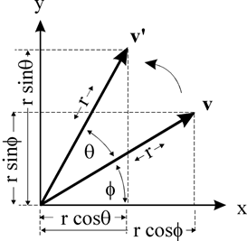
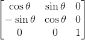
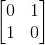
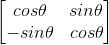

## WebGL学习笔记

### 概念和用途

WebGL (Web图形库) 是一种JavaScript API，用于在任何兼容的Web浏览器中呈现交互式3D和2D图形，而无需使用插件。

####兼容性

目前支持 WebGL1 的浏览器有: Firefox 4+, Google Chrome9+, Opera 12+, Safari5.1+ 和 Internet Explorer11+。

目前支持 WebGL2 的浏览器有: Firefox 51+, Google Chrome56+, Opera 43+。

####开发语言

JavaScript和GLSL(OpenGL着色语言)。

WebGL的开发重点在于1.着色器的编写 2.矩阵变换。

#### 基本的代码编写流程

1.获取webgl上下文环境

2.canvas屏幕适配相关设置

3.通过提前写好的顶点着色器和片段着色器创建着色器程序并让webgl使用它

4.设置着色器中顶点位置属性和颜色属性的值，并设定读取规则

5.开始绘制(可以单次或循环不断地执行4和5)

#### 最简单的代码示例(绘制一个纯色的实心平面三角形)

```html
<!DOCTYPE html>
<html lang="en">
<head>
    <meta charset="UTF-8">
    <title>Document</title>
</head>

<body>
    <!-- 画布 -->
    <canvas id="c"></canvas>

    <!-- 顶点着色器 -->
    <script id="2d-vertex-shader" type="notjs">
    attribute vec4 a_position;
    void main() {
        //所有顶点的集合
        gl_Position = a_position;
    }
    </script>
    <!-- 片段着色器 -->
    <script id="2d-fragment-shader" type="notjs">
    precision mediump float;
    void main() {
        //某一个位置的像素颜色（此处将为所有位置设置此颜色）
        gl_FragColor = vec4(1, 0, 0.5, 1);
    }
    </script>
    <script>
        "use strict";
        /* 工具函数-创建、注入和编译着色器 */
        function createShader(gl, type, source) {
            var shader = gl.createShader(type);
            gl.shaderSource(shader, source);
            gl.compileShader(shader);
            var success = gl.getShaderParameter(shader, gl.COMPILE_STATUS);
            if (success) {
                return shader;
            }

            console.log(gl.getShaderInfoLog(shader));
            gl.deleteShader(shader);
        }
        /* 工具函数-创建着色器程序 */
        function createProgram(gl, vertexShader, fragmentShader) {
            var program = gl.createProgram();
            gl.attachShader(program, vertexShader);
            gl.attachShader(program, fragmentShader);
            gl.linkProgram(program);
            var success = gl.getProgramParameter(program, gl.LINK_STATUS);
            if (success) {
                return program;
            }

            console.log(gl.getProgramInfoLog(program));
            gl.deleteProgram(program);
        }

        function main() {
            /**
             * 1.获取webgl上下文环境
             */

            // 获取webgl上下文环境
            var canvas = document.getElementById("c");
            var gl = canvas.getContext("webgl");
            if (!gl) {
                return;
            }
            /**
             * 2.canvas屏幕适配相关设置
             */

            // 使得canvas尺寸和屏幕像素尺寸保持1:1的关系，防止模糊或过度绘制
            gl.canvas.width  = gl.canvas.clientWidth;
            gl.canvas.height = gl.canvas.clientHeight;

            // 设置webgl视窗为整个画布
            gl.viewport(0, 0, gl.canvas.width, gl.canvas.height);

            /**
             * 3.通过提前写好的顶点着色器和片段着色器创建着色器程序并让gl使用它
             */

            // 分别获取顶点着色器和片段着色器内容
            var vertexShaderSource = document.getElementById("2d-vertex-shader").text;
            var fragmentShaderSource = document.getElementById("2d-fragment-shader").text;

            // 创建、注入和编译着色器
            var vertexShader = createShader(gl, gl.VERTEX_SHADER, vertexShaderSource);
            var fragmentShader = createShader(gl, gl.FRAGMENT_SHADER, fragmentShaderSource);

            // 通过顶点着色器和片段着色器创建一个着色器程序
            var program = createProgram(gl, vertexShader, fragmentShader);
            // 告诉webgl使用哪个着色器程序
            gl.useProgram(program);

            /**
             * 4.设置顶点属性的值，并设定读取规则
             */

            // 获取顶点着色器中的a_position属性
            var positionAttributeLocation = gl.getAttribLocation(program, "a_position");

            // 创建一个buffer
            var positionBuffer = gl.createBuffer();

            // 将创建的buffer绑定到gl.ARRAY_BUFFER
            gl.bindBuffer(gl.ARRAY_BUFFER, positionBuffer);

            //往gl.ARRAY_BUFFER赋值，此时positionBuffer获得值
            var positions = [
                0, 0,
                0, 0.5,
                0.7, 0,
            ];
            gl.bufferData(gl.ARRAY_BUFFER, new Float32Array(positions), gl.STATIC_DRAW);

            // 将操作对象转向a_position属性
            gl.enableVertexAttribArray(positionAttributeLocation);

            // 将positionBuffer绑定到顶点着色器的a_position属性上
            gl.bindBuffer(gl.ARRAY_BUFFER, positionBuffer);

            // 告诉a_position属性怎样读取positionBuffer中的值
            var size = 2;          // 每次读两项
            var type = gl.FLOAT;   // 类型为32位浮点型
            var normalize = false; 
            var stride = 0;        
            var offset = 0;        
            gl.vertexAttribPointer(positionAttributeLocation, size, type, normalize, stride, offset);

            /**
             * 5.开始绘制
             */
            // 使用指定颜色清除画布
            gl.clearColor(0, 0, 0, 0);
            gl.clear(gl.COLOR_BUFFER_BIT);

            // 开始绘制
            var primitiveType = gl.TRIANGLES;
            var offset = 0;
            var count = 3;
            gl.drawArrays(primitiveType, offset, count);
        }

        main();

    </script>
</body>

</html>
```


#### 着色器

- 相关约定

  1.顶点着色器中最终需要设置的变量名为gl_Position；

  2.片段着色器中最终需要设置的变量名为gl_FragColor；

  3.两种着色器都可以有多个方法，且必须要有一个main方法。

- 常用的变量类型

  1.属性（Attributes）和缓冲。缓冲是发送到GPU的一些二进制数据序列，通常情况下缓冲数据包括位置，法向量，纹理坐标，顶点颜色值等；

  2.全局变量（Uniforms）。全局变量在着色程序运行前赋值，在运行过程中全局有效；

  3.纹理（Textures）。存储图像数据或其他数据；

  4.可变量（Varyings）。一种顶点着色器给片断着色器传值的方式。

#### 矩阵变换

- 旋转矩阵推导(由于平移矩阵需要做投影运算，因此二维变换需要3*3的矩阵)

  1._第一种推导方式_：

  例如向量v**逆时针**旋转θ角度得到v':

  

  可以得到x'和y’:

  x′=rcos(θ+ϕ) = rcosθcosϕ−rsinθsinϕ = xcosθ−ysinθ

  y′=rsin(θ+ϕ) = rsinθcosϕ+rcosθsinϕ = xsinθ+ycosθ

  因此得到旋转矩阵为(竖向):

  

  2._第二种推导方式_：

  坐标是向量在某组基下的表示。

  旋转前坐标轴的基为：

  

  旋转后坐标轴的基为(竖向)：

  

  因此得到旋转矩阵为(竖向):

  

- 常用二维变换矩阵工具函数整理

  ```javascript
  var m3 = {
    identity: function() {
      return [
        1, 0, 0,
        0, 1, 0,
        0, 0, 1,
      ];
    },
    
    /**
     * 根据平移量生成平移矩阵
     */
    translation: function(tx, ty) {
      return [
        1, 0, 0,
        0, 1, 0,
        tx, ty, 1,
      ];
    },
    
    /**
     * 根据旋转弧度生成旋转矩阵
     * 
     * @param {number} angleInRadians 旋转弧度
     */
    rotation: function(angleInRadians) {
      var c = Math.cos(angleInRadians);
      var s = Math.sin(angleInRadians);
      return [
        c,-s, 0,
        s, c, 0,
        0, 0, 1,
      ];
    },
    
    /**
     * 根据缩放比生成缩放矩阵
     */
    scaling: function(sx, sy) {
      return [
        sx, 0, 0,
        0, sy, 0,
        0, 0, 1,
      ];
    },
    
    /**
     * a左乘b
     */
    multiply: function(a, b) {
      var a00 = a[0 * 3 + 0];
      var a01 = a[0 * 3 + 1];
      var a02 = a[0 * 3 + 2];
      var a10 = a[1 * 3 + 0];
      var a11 = a[1 * 3 + 1];
      var a12 = a[1 * 3 + 2];
      var a20 = a[2 * 3 + 0];
      var a21 = a[2 * 3 + 1];
      var a22 = a[2 * 3 + 2];
      var b00 = b[0 * 3 + 0];
      var b01 = b[0 * 3 + 1];
      var b02 = b[0 * 3 + 2];
      var b10 = b[1 * 3 + 0];
      var b11 = b[1 * 3 + 1];
      var b12 = b[1 * 3 + 2];
      var b20 = b[2 * 3 + 0];
      var b21 = b[2 * 3 + 1];
      var b22 = b[2 * 3 + 2];
      return [
        b00 * a00 + b01 * a10 + b02 * a20,
        b00 * a01 + b01 * a11 + b02 * a21,
        b00 * a02 + b01 * a12 + b02 * a22,
        b10 * a00 + b11 * a10 + b12 * a20,
        b10 * a01 + b11 * a11 + b12 * a21,
        b10 * a02 + b11 * a12 + b12 * a22,
        b20 * a00 + b21 * a10 + b22 * a20,
        b20 * a01 + b21 * a11 + b22 * a21,
        b20 * a02 + b21 * a12 + b22 * a22,
      ];
    },
  };
  ```

- 常用三维变换矩阵工具函数整理

  ```javascript
  var m4 = {
    
  /**
   * 将屏幕坐标(左上角，width到height)映射到webGL坐标(中心，0到1)。
   */
  projection: function(width, height, depth) {
    return [
       2 / width, 0, 0, 0,
       0, -2 / height, 0, 0,
       0, 0, 2 / depth, 0,
      -1, 1, 0, 1,
    ];
  },
  
   /**
   * a左乘b。
   */
  multiply: function(a, b) {
    var a00 = a[0 * 4 + 0];
    var a01 = a[0 * 4 + 1];
    var a02 = a[0 * 4 + 2];
    var a03 = a[0 * 4 + 3];
    var a10 = a[1 * 4 + 0];
    var a11 = a[1 * 4 + 1];
    var a12 = a[1 * 4 + 2];
    var a13 = a[1 * 4 + 3];
    var a20 = a[2 * 4 + 0];
    var a21 = a[2 * 4 + 1];
    var a22 = a[2 * 4 + 2];
    var a23 = a[2 * 4 + 3];
    var a30 = a[3 * 4 + 0];
    var a31 = a[3 * 4 + 1];
    var a32 = a[3 * 4 + 2];
    var a33 = a[3 * 4 + 3];
    var b00 = b[0 * 4 + 0];
    var b01 = b[0 * 4 + 1];
    var b02 = b[0 * 4 + 2];
    var b03 = b[0 * 4 + 3];
    var b10 = b[1 * 4 + 0];
    var b11 = b[1 * 4 + 1];
    var b12 = b[1 * 4 + 2];
    var b13 = b[1 * 4 + 3];
    var b20 = b[2 * 4 + 0];
    var b21 = b[2 * 4 + 1];
    var b22 = b[2 * 4 + 2];
    var b23 = b[2 * 4 + 3];
    var b30 = b[3 * 4 + 0];
    var b31 = b[3 * 4 + 1];
    var b32 = b[3 * 4 + 2];
    var b33 = b[3 * 4 + 3];
    return [
      b00 * a00 + b01 * a10 + b02 * a20 + b03 * a30,
      b00 * a01 + b01 * a11 + b02 * a21 + b03 * a31,
      b00 * a02 + b01 * a12 + b02 * a22 + b03 * a32,
      b00 * a03 + b01 * a13 + b02 * a23 + b03 * a33,
      b10 * a00 + b11 * a10 + b12 * a20 + b13 * a30,
      b10 * a01 + b11 * a11 + b12 * a21 + b13 * a31,
      b10 * a02 + b11 * a12 + b12 * a22 + b13 * a32,
      b10 * a03 + b11 * a13 + b12 * a23 + b13 * a33,
      b20 * a00 + b21 * a10 + b22 * a20 + b23 * a30,
      b20 * a01 + b21 * a11 + b22 * a21 + b23 * a31,
      b20 * a02 + b21 * a12 + b22 * a22 + b23 * a32,
      b20 * a03 + b21 * a13 + b22 * a23 + b23 * a33,
      b30 * a00 + b31 * a10 + b32 * a20 + b33 * a30,
      b30 * a01 + b31 * a11 + b32 * a21 + b33 * a31,
      b30 * a02 + b31 * a12 + b32 * a22 + b33 * a32,
      b30 * a03 + b31 * a13 + b32 * a23 + b33 * a33,
    ];
  },
  
  translation: function(tx, ty, tz) {
    return [
       1,  0,  0,  0,
       0,  1,  0,  0,
       0,  0,  1,  0,
       tx, ty, tz, 1,
    ];
  },
  
  xRotation: function(angleInRadians) {
    var c = Math.cos(angleInRadians);
    var s = Math.sin(angleInRadians);
  
    return [
      1, 0, 0, 0,
      0, c, s, 0,
      0, -s, c, 0,
      0, 0, 0, 1,
    ];
  },
  
  yRotation: function(angleInRadians) {
    var c = Math.cos(angleInRadians);
    var s = Math.sin(angleInRadians);
  
    return [
      c, 0, -s, 0,
      0, 1, 0, 0,
      s, 0, c, 0,
      0, 0, 0, 1,
    ];
  },
  
  zRotation: function(angleInRadians) {
    var c = Math.cos(angleInRadians);
    var s = Math.sin(angleInRadians);
  
    return [
       c, s, 0, 0,
      -s, c, 0, 0,
       0, 0, 1, 0,
       0, 0, 0, 1,
    ];
  },
  
  scaling: function(sx, sy, sz) {
    return [
      sx, 0,  0,  0,
      0, sy,  0,  0,
      0,  0, sz,  0,
      0,  0,  0,  1,
    ];
  },
  
  translate: function(m, tx, ty, tz) {
    return m4.multiply(m, m4.translation(tx, ty, tz));
  },
  
  xRotate: function(m, angleInRadians) {
    return m4.multiply(m, m4.xRotation(angleInRadians));
  },
  
  yRotate: function(m, angleInRadians) {
    return m4.multiply(m, m4.yRotation(angleInRadians));
  },
  
  zRotate: function(m, angleInRadians) {
    return m4.multiply(m, m4.zRotation(angleInRadians));
  },
  
  scale: function(m, sx, sy, sz) {
    return m4.multiply(m, m4.scaling(sx, sy, sz));
  },
  
  /**
   * 求逆矩阵(相机实现需要)
   */
  inverse: function(m) {
    var m00 = m[0 * 4 + 0];
    var m01 = m[0 * 4 + 1];
    var m02 = m[0 * 4 + 2];
    var m03 = m[0 * 4 + 3];
    var m10 = m[1 * 4 + 0];
    var m11 = m[1 * 4 + 1];
    var m12 = m[1 * 4 + 2];
    var m13 = m[1 * 4 + 3];
    var m20 = m[2 * 4 + 0];
    var m21 = m[2 * 4 + 1];
    var m22 = m[2 * 4 + 2];
    var m23 = m[2 * 4 + 3];
    var m30 = m[3 * 4 + 0];
    var m31 = m[3 * 4 + 1];
    var m32 = m[3 * 4 + 2];
    var m33 = m[3 * 4 + 3];
    var tmp_0  = m22 * m33;
    var tmp_1  = m32 * m23;
    var tmp_2  = m12 * m33;
    var tmp_3  = m32 * m13;
    var tmp_4  = m12 * m23;
    var tmp_5  = m22 * m13;
    var tmp_6  = m02 * m33;
    var tmp_7  = m32 * m03;
    var tmp_8  = m02 * m23;
    var tmp_9  = m22 * m03;
    var tmp_10 = m02 * m13;
    var tmp_11 = m12 * m03;
    var tmp_12 = m20 * m31;
    var tmp_13 = m30 * m21;
    var tmp_14 = m10 * m31;
    var tmp_15 = m30 * m11;
    var tmp_16 = m10 * m21;
    var tmp_17 = m20 * m11;
    var tmp_18 = m00 * m31;
    var tmp_19 = m30 * m01;
    var tmp_20 = m00 * m21;
    var tmp_21 = m20 * m01;
    var tmp_22 = m00 * m11;
    var tmp_23 = m10 * m01;
  
    var t0 = (tmp_0 * m11 + tmp_3 * m21 + tmp_4 * m31) -
        (tmp_1 * m11 + tmp_2 * m21 + tmp_5 * m31);
    var t1 = (tmp_1 * m01 + tmp_6 * m21 + tmp_9 * m31) -
        (tmp_0 * m01 + tmp_7 * m21 + tmp_8 * m31);
    var t2 = (tmp_2 * m01 + tmp_7 * m11 + tmp_10 * m31) -
        (tmp_3 * m01 + tmp_6 * m11 + tmp_11 * m31);
    var t3 = (tmp_5 * m01 + tmp_8 * m11 + tmp_11 * m21) -
        (tmp_4 * m01 + tmp_9 * m11 + tmp_10 * m21);
  
    var d = 1.0 / (m00 * t0 + m10 * t1 + m20 * t2 + m30 * t3);
  
    return [
      d * t0,
      d * t1,
      d * t2,
      d * t3,
      d * ((tmp_1 * m10 + tmp_2 * m20 + tmp_5 * m30) -
            (tmp_0 * m10 + tmp_3 * m20 + tmp_4 * m30)),
      d * ((tmp_0 * m00 + tmp_7 * m20 + tmp_8 * m30) -
            (tmp_1 * m00 + tmp_6 * m20 + tmp_9 * m30)),
      d * ((tmp_3 * m00 + tmp_6 * m10 + tmp_11 * m30) -
            (tmp_2 * m00 + tmp_7 * m10 + tmp_10 * m30)),
      d * ((tmp_4 * m00 + tmp_9 * m10 + tmp_10 * m20) -
            (tmp_5 * m00 + tmp_8 * m10 + tmp_11 * m20)),
      d * ((tmp_12 * m13 + tmp_15 * m23 + tmp_16 * m33) -
            (tmp_13 * m13 + tmp_14 * m23 + tmp_17 * m33)),
      d * ((tmp_13 * m03 + tmp_18 * m23 + tmp_21 * m33) -
            (tmp_12 * m03 + tmp_19 * m23 + tmp_20 * m33)),
      d * ((tmp_14 * m03 + tmp_19 * m13 + tmp_22 * m33) -
            (tmp_15 * m03 + tmp_18 * m13 + tmp_23 * m33)),
      d * ((tmp_17 * m03 + tmp_20 * m13 + tmp_23 * m23) -
            (tmp_16 * m03 + tmp_21 * m13 + tmp_22 * m23)),
      d * ((tmp_14 * m22 + tmp_17 * m32 + tmp_13 * m12) -
            (tmp_16 * m32 + tmp_12 * m12 + tmp_15 * m22)),
      d * ((tmp_20 * m32 + tmp_12 * m02 + tmp_19 * m22) -
            (tmp_18 * m22 + tmp_21 * m32 + tmp_13 * m02)),
      d * ((tmp_18 * m12 + tmp_23 * m32 + tmp_15 * m02) -
            (tmp_22 * m32 + tmp_14 * m02 + tmp_19 * m12)),
      d * ((tmp_22 * m22 + tmp_16 * m02 + tmp_21 * m12) -
            (tmp_20 * m12 + tmp_23 * m22 + tmp_17 * m02))
    ];
  },
  
  /**
   * 向量v与m叉乘(即求法向量)
   */
  vectorMultiply: function(v, m) {
    var dst = [];
    for (var i = 0; i < 4; ++i) {
      dst[i] = 0.0;
      for (var j = 0; j < 4; ++j) {
        dst[i] += v[j] * m[j * 4 + i];
      }
    }
    return dst;
  },
  
  };
  ```

####三维透视原理总结

最简单的做法：

将(x, y, z)变为(x/z, y/z, z)，z值越大物体越小，可以再乘一个系数作为调节。

####相机变换原理总结

若相机的变换矩阵为A，则先求出A的逆矩阵A^-1^ ，再将A^-1^ 应用与当前场景即可(A^-1^左乘vector4)。比如相机左移时，进行该操作后，对应的物体是右移，在视觉上给人的感觉依然是相机左移。

#### 游戏光照系统原理总结

_注：任意形状的3D物体都可以由很多个平面三角形组合完成渲染，例如球形、立方体和不规则立体图形，因此计算物体表面某个点所在平面的法向量是比较容易的_ ，三角形任意两条边向量的叉乘即这个面的法向量 。

- 平行光：

  将三维物体的朝向(即平面法向量)和光的方向点乘得到一个数值a，再将a与该位置颜色值相乘。a的范围是-1到1，|a|越小位置颜色越暗。

- 点光源

  …...

- 聚光灯

  …...

####WebGL图像处理

…...

####如何使用纹理

…...